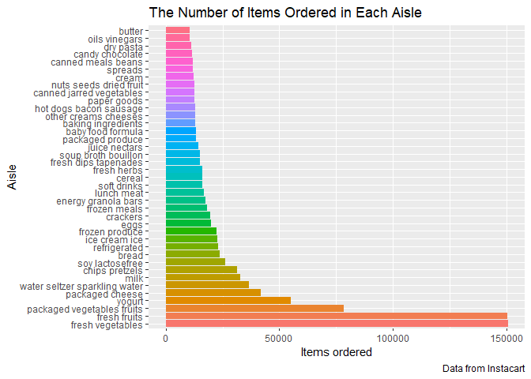
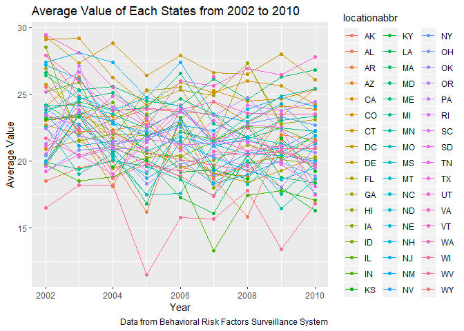
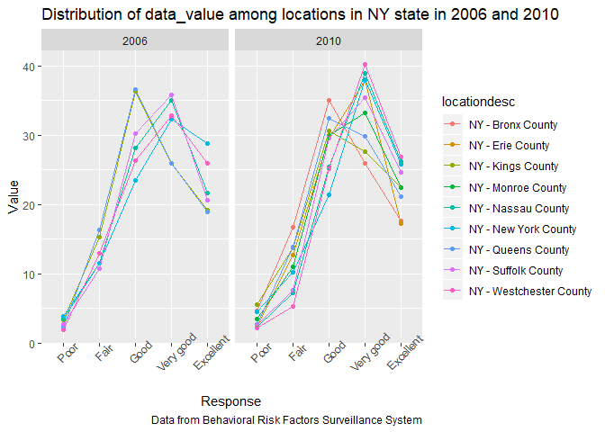
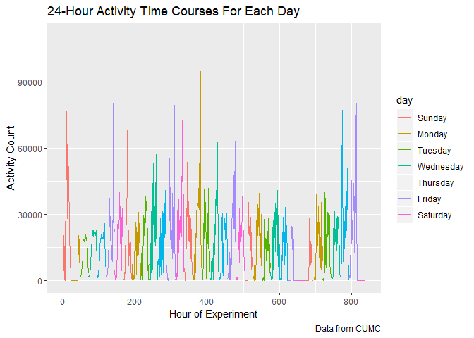

p8105\_hw3\_yj2581
================
YucongJiang
2019-10-11

Problem 1
---------

#### Describe the dataset

``` r
data("instacart")
```

-   The dataset `instacart` has 1384617 observations and 15 variables.
-   The structure of `instacart` grouped by the variable `department` is shown below.

| department      |       n|
|:----------------|-------:|
| alcohol         |    5598|
| babies          |   14941|
| bakery          |   48394|
| beverages       |  114046|
| breakfast       |   29500|
| bulk            |    1359|
| canned goods    |   46799|
| dairy eggs      |  217051|
| deli            |   44291|
| dry goods pasta |   38713|
| frozen          |  100426|
| household       |   35986|
| international   |   11902|
| meat seafood    |   30307|
| missing         |    8251|
| other           |    1795|
| pantry          |   81242|
| personal care   |   21570|
| pets            |    4497|
| produce         |  409087|
| snacks          |  118862|

-   `order_id`, `product_id`, `user_id`, `aisle_id` and `department_id` are identifiers of orders, products, customers, aisles and departments, respectively.
-   `order_dow` and `order_hour_of_day` indicate the time of order in a week.
-   `reordered` shows whether the product has been ordered by this customer before. 1:yes, 0:no
-   `days_since_prior_order` means the days since the last order, capped at 30 days. `NA` if it's the first order.

For example, the first observations in the original datasets indicates that: \* A customer with id '112108' bought Bulgarian Yogurt at 10 am on a Thursday. \* It's not the first time he or she bought this product. \* It's the fourth time he or she made an order in Instacart. \* This customer just made an order 9 days before this one. \* From the first 8 observations we can also know that this customer bought 7 other products in the same order.

|  order\_id|  product\_id|  add\_to\_cart\_order|  reordered|  user\_id| eval\_set |  order\_number|  order\_dow|  order\_hour\_of\_day|  days\_since\_prior\_order| product\_name                                 |  aisle\_id|  department\_id| aisle                | department   |
|----------:|------------:|---------------------:|----------:|---------:|:----------|--------------:|-----------:|---------------------:|--------------------------:|:----------------------------------------------|----------:|---------------:|:---------------------|:-------------|
|          1|        49302|                     1|          1|    112108| train     |              4|           4|                    10|                          9| Bulgarian Yogurt                              |        120|              16| yogurt               | dairy eggs   |
|          1|        11109|                     2|          1|    112108| train     |              4|           4|                    10|                          9| Organic 4% Milk Fat Whole Milk Cottage Cheese |        108|              16| other creams cheeses | dairy eggs   |
|          1|        10246|                     3|          0|    112108| train     |              4|           4|                    10|                          9| Organic Celery Hearts                         |         83|               4| fresh vegetables     | produce      |
|          1|        49683|                     4|          0|    112108| train     |              4|           4|                    10|                          9| Cucumber Kirby                                |         83|               4| fresh vegetables     | produce      |
|          1|        43633|                     5|          1|    112108| train     |              4|           4|                    10|                          9| Lightly Smoked Sardines in Olive Oil          |         95|              15| canned meat seafood  | canned goods |
|          1|        13176|                     6|          0|    112108| train     |              4|           4|                    10|                          9| Bag of Organic Bananas                        |         24|               4| fresh fruits         | produce      |
|          1|        47209|                     7|          0|    112108| train     |              4|           4|                    10|                          9| Organic Hass Avocado                          |         24|               4| fresh fruits         | produce      |
|          1|        22035|                     8|          1|    112108| train     |              4|           4|                    10|                          9| Organic Whole String Cheese                   |         21|              16| packaged cheese      | dairy eggs   |

#### Do or answer the following

###### The number of aisles, the aisle which the most items ordered from.

``` r
# number of aisles
length(unique(pull(instacart, aisle)))
```

    ## [1] 134

``` r
# the aisle which the most items ordered from
instacart %>%
  group_by(aisle) %>%
  summarize(n = n()) %>%
  filter(n == max(n)) %>%
  pull(aisle)
```

    ## [1] "fresh vegetables"

###### The plot of the number of items ordered in each aisle (&gt;10000)

``` r
# split data from original dataset
aisle_data <- instacart %>%
  group_by(aisle) %>%
  summarize(n = n()) %>%
  filter(n > 10000) %>%
  arrange(n = desc(n)) %>%
  mutate(
    aisle = factor(aisle, levels = aisle)
  )

# create the bar-plot
ggplot(aisle_data, aes(x = aisle, y = n, fill = aisle)) + 
  geom_bar(stat = "identity") +
  coord_flip() +
  labs(
    title = "The Number of Items Ordered in Each Aisle",
    x = "Aisle",
    y = "Items ordered",
    caption = "Data from Instacart"
  ) +
  theme(
    legend.position = "none"
  )
```



###### Show the 3 most popular items in aisles “baking ingredients”, “dog food care”, and “packaged vegetables fruits”.

``` r
# collect data based on the instruction
table_data_1 <- instacart %>%
  filter(aisle == "baking ingredients" | aisle == "dog food care" | aisle == "packaged vegetables fruits") %>%
  group_by(aisle, product_name) %>%
  summarize(time_ordered = n()) %>%
  filter(time_ordered %in% sort(time_ordered, decreasing = TRUE)[1:3])

# show the table
knitr::kable(table_data_1)
```

| aisle                      | product\_name                                 |  time\_ordered|
|:---------------------------|:----------------------------------------------|--------------:|
| baking ingredients         | Cane Sugar                                    |            336|
| baking ingredients         | Light Brown Sugar                             |            499|
| baking ingredients         | Pure Baking Soda                              |            387|
| dog food care              | Organix Chicken & Brown Rice Recipe           |             28|
| dog food care              | Small Dog Biscuits                            |             26|
| dog food care              | Snack Sticks Chicken & Rice Recipe Dog Treats |             30|
| packaged vegetables fruits | Organic Baby Spinach                          |           9784|
| packaged vegetables fruits | Organic Blueberries                           |           4966|
| packaged vegetables fruits | Organic Raspberries                           |           5546|

###### Show mean hour of day at which Pink Lady Apples and Coffee Ice Cream are ordered

``` r
# first assign a variable with the 7 days
week <- c("Sunday","Monday","Tuesday","Wednesday","Thursday","Friday","Saturday")

# collect data for the table
table_data_2 <- instacart %>%
  filter(product_name == "Pink Lady Apples" | product_name == "Coffee Ice Cream") %>%
  mutate(
    # factorize day_of_week to maintain its order
    day_of_week = factor(week[order_dow+1], levels = week)
  ) %>%
  group_by(product_name, day_of_week) %>%
  summarize(mean_hour = round(mean(order_hour_of_day),1)) %>%
  pivot_wider(
    names_from = "day_of_week",
    values_from = "mean_hour"
  )

knitr::kable(table_data_2)
```

| product\_name    |  Sunday|  Monday|  Tuesday|  Wednesday|  Thursday|  Friday|  Saturday|
|:-----------------|-------:|-------:|--------:|----------:|---------:|-------:|---------:|
| Coffee Ice Cream |    13.8|    14.3|     15.4|       15.3|      15.2|    12.3|      13.8|
| Pink Lady Apples |    13.4|    11.4|     11.7|       14.2|      11.6|    12.8|      11.9|

Problem 2
---------

#### Read and do some data cleaning

``` r
data("brfss_smart2010")

# assign a variable with response level
response_level <- c("Poor","Fair","Good","Very good","Excellent")

# load and tidy the data
brfss <- brfss_smart2010 %>%
  janitor::clean_names() %>%
  filter(topic == "Overall Health") %>%
  filter(response %in% response_level) %>%
  mutate(
    response = factor(response, levels = response_level, ordered = TRUE)
  )
```

    ## Warning in FUN(X[[i]], ...): strings not representable in native encoding
    ## will be translated to UTF-8

#### Do or answer the following

###### Which states were observed at 7 or more locations in 2002 and 2010?

``` r
# result in 2002
brfss %>%
  filter(year == 2002) %>%
  group_by(locationabbr) %>%
  filter(length(unique(locationdesc))>=7) %>%
  distinct(locationabbr) %>%
  pull(locationabbr)
```

    ## [1] "CT" "FL" "MA" "NJ" "NC" "PA"

``` r
# result in 2010
brfss %>%
  filter(year == 2010) %>%
  group_by(locationabbr) %>%
  filter(length(unique(locationdesc))>=7) %>%
  distinct(locationabbr) %>%
  pull(locationabbr)
```

    ##  [1] "CA" "CO" "FL" "MD" "MA" "NE" "NJ" "NY" "NC" "OH" "PA" "SC" "TX" "WA"

###### Construct a dataset limited to "Excellent" response, create a "spaghetti" plot based on the instruction

``` r
# collect data based on instruction
spaghetti_data <- brfss %>%
  filter(response == "Excellent") %>%
  select(year, locationabbr, data_value) %>%
  group_by(year, locationabbr) %>%
  summarize(average_data_value = mean(data_value))

# create the plot
ggplot(spaghetti_data, aes(x = year, y = average_data_value, color = locationabbr, group = locationabbr)) +
  geom_point() + geom_line() +
  labs(
    title = "Average Value of Each States from 2002 to 2010",
    x = "Year",
    y = "Average Value",
    caption = "Data from Behavioral Risk Factors Surveillance System"
  )
```



###### Show the distribution of `data_value` among locations in NY state in 2006 and 2010

``` r
# split data from original dataset
two_panel_data <- brfss %>%
  filter(year == 2006 | year == 2010) %>%
  filter(locationabbr == "NY") %>%
  select(year, locationdesc, response, data_value)

# create the plot and make it more reader-friendly
ggplot(two_panel_data, aes(x = response, y = data_value, color = locationdesc, group = locationdesc)) +
  geom_point() + geom_line() +
  facet_grid(.~year) +
  labs(
    title = "Distribution of data_value among locations in NY state in 2006 and 2010",
    x = "Response",
    y = "Value",
    caption = "Data from Behavioral Risk Factors Surveillance System"
  ) +
  theme(
    axis.text.x = element_text(angle = 45)
  )
```



Problem 3
---------

#### Load and tidy the data

``` r
# assign a variable with the 7 days
week_seq <- c("Sunday","Monday","Tuesday","Wednesday","Thursday","Friday","Saturday")

# clean the data
accel <- read_csv("./data/accel_data.csv") %>%
  janitor::clean_names() %>%
  rename(day_show = day_id) %>%
  mutate(
    day = factor(day, levels = week_seq),
    weekday_or_weekend = ifelse(day %in% c("Saturday","Sunday"), "weekend", "weekday"),
    day_id = (week - 1) * 7 + as.numeric(day)
  ) %>%
  arrange(week, day) %>%
  pivot_longer(
    activity_1:activity_1440,
    names_to = "minute_of_day",
    names_prefix = "activity_",
    values_to = "activity_count"
  ) %>%
  mutate(
    minute_of_day = as.numeric(minute_of_day)
  ) %>%
  select(day_id, day_show, week, day, weekday_or_weekend, minute_of_day, activity_count)
```

###### Describe the data

-   The resulting dataset contains 7 variables and 50400 observations.
-   The variables `day_id` represents the order in which the days were observed, supposing that **the experiment started from Sunday**.
-   **The `day_show` is the original `day_id`**, which is the order in which they appear in the original dataset.
-   `weekday_or_weekend` shows whether the day is weekend or weekday.
-   `minute_of_day` and `activity_count` are transformed from the original activity.\*.

#### Aggregate the activity counts accross minutes

``` r
accel_aggregate <- accel %>%
  group_by(week, day) %>%
  summarize(activity_total = sum(activity_count)) %>%
  pivot_wider(
    names_from = "day",
    values_from = "activity_total"
  )

knitr::kable(accel_aggregate)
```

|  week|  Sunday|     Monday|   Tuesday|  Wednesday|  Thursday|    Friday|  Saturday|
|-----:|-------:|----------:|---------:|----------:|---------:|---------:|---------:|
|     1|  631105|   78828.07|  307094.2|     340115|  355923.6|  480542.6|    376254|
|     2|  422018|  295431.00|  423245.0|     440962|  474048.0|  568839.0|    607175|
|     3|  467052|  685910.00|  381507.0|     468869|  371230.0|  467420.0|    382928|
|     4|  260617|  409450.00|  319568.0|     434460|  340291.0|  154049.0|      1440|
|     5|  138421|  389080.00|  367824.0|     445366|  549658.0|  620860.0|      1440|

There are some outliers in this table, i.e. Monday in Week 1, Sunday in Week 5, Fridayin Week 4 and Saturday in Week 4 and 5. Maybe the participant took off the accelerometers for a long time in these days.

#### Show 24-hour activity time courses for each day

``` r
accel_hour <- accel %>%
  mutate(
    hour_of_experiment = 24 * (day_id - 1) + ceiling(minute_of_day/60.0) - 1
  ) %>%
  group_by(day_id, day, hour_of_experiment) %>%
  summarize(activity_hour = sum(activity_count))

ggplot(accel_hour, aes(x = hour_of_experiment, y = activity_hour, group = day_id)) +
  geom_line(aes(color = day)) +
  labs(
    title = "24-Hour Activity Time Courses For Each Day",
    x = "Hour of Experiment",
    y = "Activity Count",
    caption = "Data from CUMC"
  )
```



From the plot we know that

-   Generally, the activity counts are low at night and high during the day.
-   There are some periods in which the activity counts are extremely low. We suppose that the participant took the accelerometer off during those times.
-   There are also some periods in which the counts are extremely high. We suppose that the participant did physical activities during those times.
-   There is no explicit pattern about on which day the participant did the physical activities.
